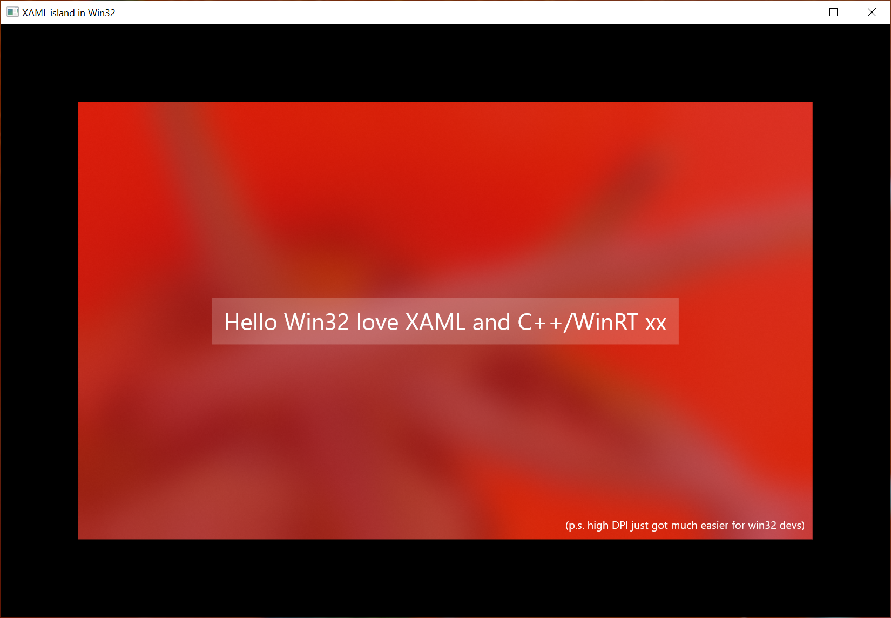

# XAML Islands in a Windows Desktop app
As of Windows 10 Build 17713 XAML Islands work in desktop windows apps.  Building and running this sample requires the Windows SDK Insider Preview Build 17709.

The sample shows how to create a simple High DPI aware Win32 app in C++ with some text and an Acrylic background.  C++/WinRT is used to make this super simple and readble.

### Known Issues specific to Windows 10 Build 17713
1) If you launch the project with the debugger attached there will be some unhandled exceptions before the window shows up.  This is a known bug.

2) Similarly, on app exit there will also be an exception on cleanup.  This is also a known bug.

